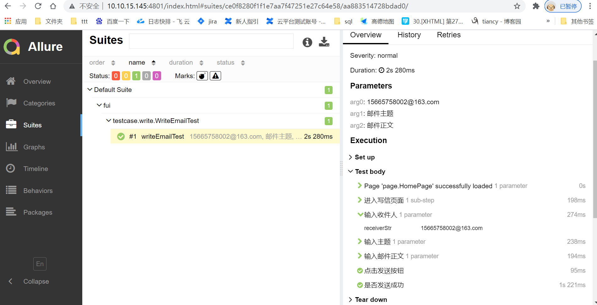
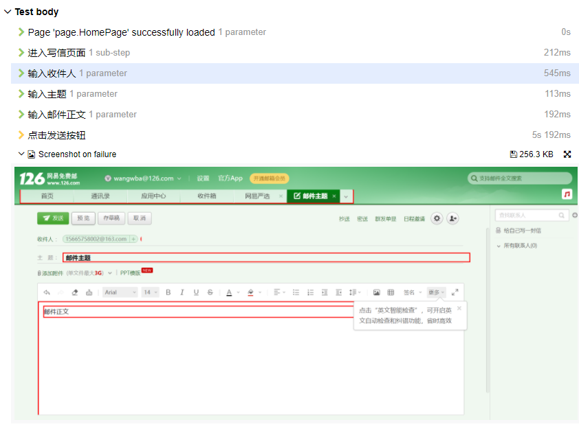

<h1 align="center">
  <br>
  Fui
  <br>
</h1>
<p align="center">
	<strong>一个用java编写，基于Selenium和WebDriver的UI自动化框架，框架参考了许多优秀的开源的UI自动化框架，希望能完成一个更适合B端商家后台系统的UI自动化框架。</strong>
</p>

<p align="center">
  <a href="#特点：">特点</a> •
  <a href="#用例编写">用例编写</a> •
  <a href="#配置">配置</a> •
  <a href="#代码结构">代码结构</a> •
  <a href="#使用说明">使用说明</a> •
  <a href="#用例编写">用例编写</a> •
  <a href="#页面对象">页面对象</a> •
  <a href="#其他">其他</a> 
</p>
-----------------------------------------------------------------------------------------------


## 📚特点：
* 设计模式采用业界通用的pageObject、PageFactory模式，并支持页面公共组件单独定义，页面共用。
* 采用WebDriverManager管理浏览器driver，自动下载匹配的浏览器驱动，并设置环境变量，无需手动干预，除非有特殊要求。
* 支持多线程并行执行用例，复用完成登录的浏览器driver。
* 封装了一些前端复杂组件的操作方法,更适合react前端框架编写的系统，在Bot类中。
* 支持csv格式的数据驱动，支持在用例上用注解指定csv文件路径。
* 支持在allure报告中显示失败页面截图。支持钉钉报告。
* 支持用例执行失败后重试。
* 高亮显示定位到的元素。

## 📚配置：
* 在resources目录下，env.prpperties 配置文件：configDriver指定驱动的配置文件，后面是登录地址和账号，和钉钉通知的群url。
* driver.yaml用来配置浏览器driver：browser：指定测试用的浏览器(对于FIREFOX、CHROME、EDGE、IE可以直接配置使用，其他浏览器需要自己手动设置driver路径)。headless：设置是否用浏览器的无头模式，可填true。maximise：配置浏览器是否最大化窗口。threads：设置启动的浏览器个数。


## 📚代码结构：

```
common.basic: 封装的操作元素的方法
common.config: 读取配置文件的类
common.config.dataProvider: 数据驱动工具类
common.driver: 创建浏览器driver相关方法
common.driver.driverImpl: 浏览器驱动的实现类,可以对浏览器驱动设置启动参数
common.listener: 监听器类：重试监听器、操作事件监听器（打印log）、钉钉报告监听器、失败截图监听器。
common.reporting.allure: allure报告相关。
common.testLiftcycle: 测试用例需要的基类，用例执行前创建浏览器driver，处理登录，以及用例执行后销毁driver。
common.element: 元素高亮处理类。等待元素加载处理类。
common.page: 页面对象需要继承的基类BasePage。获取页面的PageFactory。

component：页面共用的组件可以放到这个目录下。注意要继承 HtmlElement
page： 页面对象放到这个目录下。需要继承BasePage

```

## 📝使用说明
1. 配置evn.properties 和 driver.yaml 文件。
2. 先在common.testLifecycle目录下的PreLogin类中编写登录逻辑，initBrowserBeforeTest方法会用到。
3. 在page目录下编写测试用例用到的页面对象，如果有共用组件，放到component目录下。
4. 在test/java/testcase目录下，编写测试用例。数据驱动文件放到test/java/testdata目录下。
5. 运行用例：可以在单个测试用例上用testng执行，也可以用mvn test 运行 testng.xml中配置的用例。

## 📝用例编写
* 用例需要继承 UIBaseTest 类，此类会在用例执行之前打开浏览器，并登录。  
* 用例如果需要数据驱动，可以像这样：

```java
public class WriteEmailTest extends BaseUITest {

    @Test(dataProvider = "getData", dataProviderClass = CsvDataProvider.class)
    public void writeEmailTest(String receiver,String title,String emailText) {
        WriteEmailPage writeEmailPage = PageFactory.getPage(HomePage.class).openWriteEmailPage();
        writeEmailPage.inputReceiver(receiver)
                .inputTitle(title)
                .inputEmail(emailText)
                .clickSend();

        assertThat(writeEmailPage.isSuccess()).isTrue();
    }
}
```
程序默认会去testdata相同路径下，测试用例class名称目录下查找csv文件。具体可以查看代码中的例子。
当然也可以直接用@Csv 注解指定csv文件。  
* 记得增加断言逻辑。

## 📦页面对象
* 页面对象放到src/main/java/page目录下，页面类要继承UIBasePage<T>,类中定义了一些操作页面的方法，包括给页面对象初始化元素。  
* 页面对象中，可以用@Name注解给元素定义名字，用@Step注解给操作方法增加名称，这些名字会显示在allure报告里。  
例如： 
  
```java
public class WriteEmailPage extends BasePage<WriteEmailPage> {

    @Name("发送按钮")
    @FindBy(xpath = "//div[@role='toolbar']//span[text()='发送']")
    private WebElement sendButton;

    @Name("收件人输入框")
    @FindBy(xpath = "//input[contains(@aria-label,'收件人地址输入框')]")
    private WebElement receiver;

    @Step("输入收件人")
    public WriteEmailPage inputReceiver(String receiverStr) {
        receiver.sendKeys(receiverStr);
        return this;
    }

    @Step("点击发送按钮")
    public WriteEmailPage clickSend() {
        sendButton.click();
        return this;
    }
} 
```

* allure报告如图：   


* 如果用例执行失败，allure步骤中会有报错页面的截图：



## 📦其他
* 如果需要集成Jenkins查看allure报告，需要在Jenkins安装allure插件，并配置报告目录。如果想在本地查看运行报告，需要将命令行目录切换到target目录下，运行 allure serve命令，会自动弹出allure报告。
* 工具默认使用chrome浏览器，可以在配置文件指定其他浏览器。
* 尽量不配置全局的重试监听器，因为重试第三次的报错信息有可能和第一次不一致，这时候就看不到第一次的报错原因了。如果遇到解决不了的问题，可在单个测试用例上单独加重试监听器
* 如果要配置多线程执行用例，在配置文件中配置的threads数和 testng.xml中配置的并行数最好一致。
